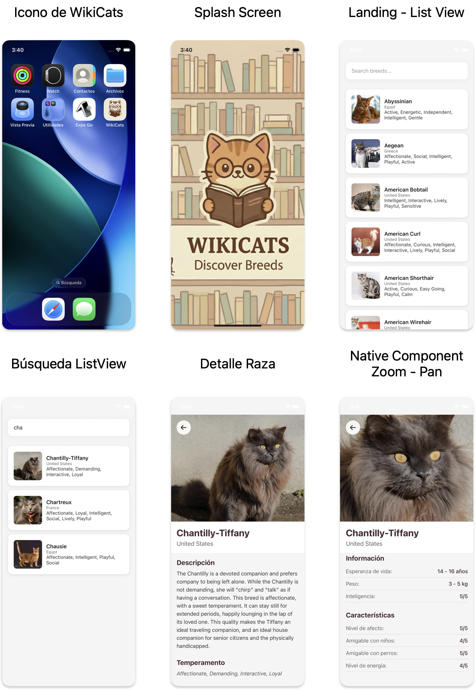

# Cat Breeds App - React Native

## Introducción

Este proyecto ha sido desarrollado con fines de **prueba técnica**, cumpliendo con todos los escenarios y requerimientos solicitados. La aplicación permite explorar diferentes razas de gatos, visualizar sus detalles y navegar de manera fluida entre pantallas.

### Decisiones Arquitectónicas

El proyecto implementa una **arquitectura escalable y modular** que permite el crecimiento sostenible de la aplicación. Se han aplicado principios de **SOLID** y **Clean Code** en todo el desarrollo, garantizando un código mantenible, legible y fácil de extender.

#### Principios Aplicados:
- **Single Responsibility Principle (SRP)**: Cada componente y módulo tiene una única responsabilidad bien definida.
- **Separation of Concerns**: Clara separación entre lógica de negocio, presentación y gestión de estado.
- **Clean Code**: Nombres descriptivos, funciones pequeñas y cohesivas, y código autodocumentado.
- **Feature-Based Architecture**: Organización por features/módulos en lugar de por tipo de archivo.

## Screenshots



## Estructura del Proyecto

```
.
├── app-icons/                    # Iconos de la aplicación
├── ios/                          # Configuración nativa de iOS
│   └── CatBreedsRNApp/          # Archivos Swift y configuración
└── src/                          # Código fuente de la aplicación
    ├── assets/                   # Recursos estáticos
    │   ├── bootsplash/          # Splash screen assets
    │   └── images/              # Imágenes de la aplicación
    ├── components/              # Componentes compartidos
    │   ├── layouts/             # Componentes de layout (headers, wrappers)
    │   └── ui/                  # Componentes UI reutilizables
    ├── config/                  # Configuración global
    │   ├── constants.ts         # Constantes de la aplicación
    │   ├── queryClient.ts       # Configuración de React Query
    │   └── reactotron.ts        # Configuración de Reactotron (dev tools)
    ├── core/                    # Núcleo de la aplicación
    │   └── navigation/          # Configuración de navegación
    ├── features/                # Features/Módulos de la aplicación
    │   └── breeds/              # Feature de razas de gatos
    │       ├── components/      # Componentes específicos del feature
    │       ├── hooks/           # Custom hooks del feature
    │       ├── navigation/      # Navegación específica del feature
    │       ├── screens/         # Pantallas del feature
    │       ├── services/        # Servicios/API calls
    │       ├── shared/          # Utilidades compartidas del feature
    │       └── types/           # Tipos TypeScript del feature
    └── store/                   # Gestión de estado global
        └── breedsStore.ts       # Store de Zustand para breeds
```
## Requisitos Previos

> **Nota**: Asegúrate de tener configurado tu entorno de desarrollo para React Native siguiendo la [guía oficial](https://reactnative.dev/docs/set-up-your-environment).

### Versiones Requeridas

- **Node.js**: v22.21.1
- **npm**: 10.9.4
- **Gestión de Paquetes**: Solo se utiliza **npm** (no yarn ni otros gestores)

## Getting Started

### 1. Clonar el Repositorio e Instalar Dependencias

```sh
# Instalar dependencias de npm
npm install
```

### 2. Configurar Dependencias Nativas (Solo iOS)

Para iOS, es necesario instalar las dependencias de CocoaPods. 

**Primera vez** o después de clonar el proyecto:

```sh
# Instalar bundler (si no lo tienes instalado)
bundle install

# Instalar pods
cd ios
bundle exec pod install
cd ..
```

**Cada vez que se actualicen las dependencias nativas:**

```sh
cd ios
bundle exec pod install
cd ..
```

### 3. Iniciar Metro Bundler

Metro es el bundler de JavaScript para React Native. Debes iniciarlo antes de ejecutar la aplicación:

```sh
npm start
```

### 4. Ejecutar la Aplicación

Con Metro ejecutándose, abre una nueva terminal y ejecuta uno de los siguientes comandos:

#### iOS

```sh
npm run ios
```

#### Android

```sh
npm run android
```

Si todo está configurado correctamente, deberías ver la aplicación ejecutándose en el simulador de iOS, emulador de Android o dispositivo físico conectado.

## Scripts Disponibles

- `npm start`: Inicia Metro Bundler
- `npm run ios`: Ejecuta la app en iOS
- `npm run android`: Ejecuta la app en Android
- `npm test`: Ejecuta los tests con Jest
- `npm run lint`: Ejecuta el linter (ESLint)

## Tecnologías Utilizadas

- **React Native**: Framework principal
- **TypeScript**: Tipado estático
- **React Query (TanStack Query)**: Gestión de estado del servidor
- **Zustand**: Gestión de estado global
- **React Navigation**: Navegación entre pantallas
- **Axios**: Cliente HTTP para llamadas a API
- **React Native Bootsplash**: Splash screen nativo
- **Fast Image**: Optimización de carga de imágenes

## Recursos Adicionales

- [Documentación de React Native](https://reactnative.dev)
- [Documentación de TypeScript](https://www.typescriptlang.org/)
- [React Query Docs](https://tanstack.com/query/latest)
- [Zustand Docs](https://docs.pmnd.rs/zustand/getting-started/introduction)
